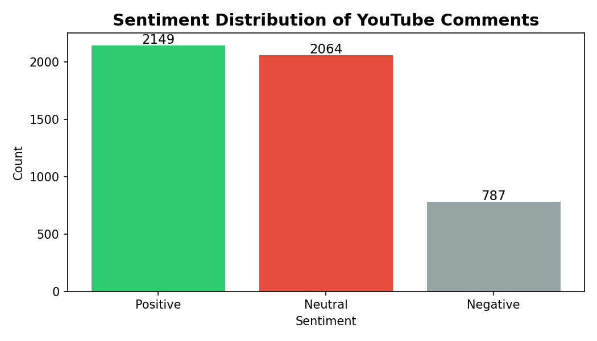
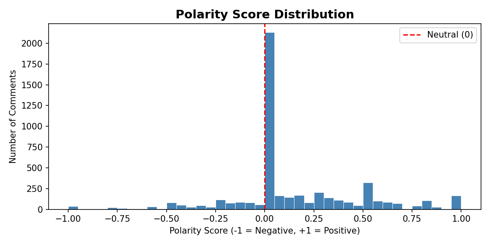
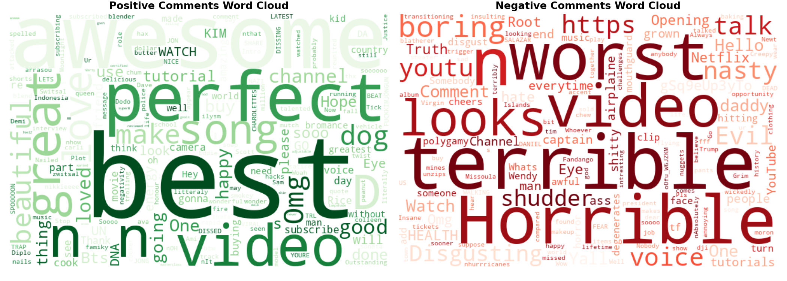
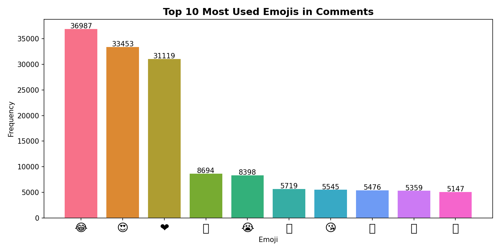
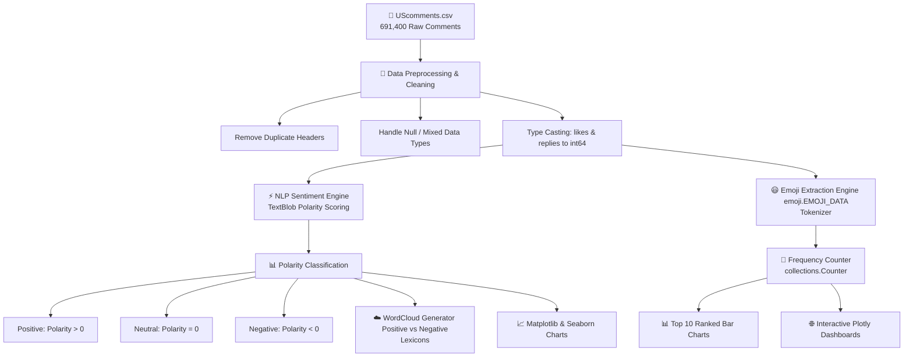

<div align="center">

# 📊 YouTube Comments Sentiment & Emoji Analysis

### *Deep-Dive Natural Language Processing & Sentiment Mining on 690,000+ YouTube Comments*

[](https://www.python.org/)
[](https://jupyter.org/)
[](https://pandas.pydata.org/)
[](https://plotly.com/)
[](https://opensource.org/licenses/MIT)
[](https://github.com/Nayan0223/Youtube-comments-analysis)

<p align="center">
  <a href="#-project-overview">Overview</a> •
  <a href="#-key-insights--findings">Key Insights</a> •
  <a href="#-visual-gallery">Visual Gallery</a> •
  <a href="#-data-pipeline--architecture">Pipeline</a> •
  <a href="#-tech-stack">Tech Stack</a> •
  <a href="#-quick-start">Quick Start</a> •
  <a href="#-project-structure">Structure</a> •
  <a href="#-future-roadmap">Roadmap</a>
</p>

---

</div>

## 📌 Project Overview

This repository features an end-to-end **Data Analysis & Natural Language Processing (NLP)** pipeline built to analyze viewer sentiment, polarity distributions, and emoji usage patterns across **691,000+ real-world YouTube comments**.

Using **TextBlob**, **WordCloud**, **Emoji 2.0+**, **Seaborn**, and **Plotly**, this project extracts actionable behavioral insights from audience engagement on trending YouTube videos.

---

## ⚡ Key Highlights & Metrics

<div align="center">

| 📁 Dataset Scale | 💬 Analyzed Comments | 😃 Emojis Extracted | 🎯 Sentiment Classes |
| :---: | :---: | :---: | :---: |
| **691,400+ Rows** | **691,373 Cleaned** | **294,549 Emojis** | **Positive / Neutral / Negative** |

</div>

---

## 💡 Key Insights & Findings

### 1. Overall Sentiment Distribution
Viewer feedback on YouTube skews significantly **optimistic and constructive**:

- 🟢 **Positive Comments (~43%)**: Praise, enthusiasm, appreciation, and excitement.
- ⚪ **Neutral Comments (~41%)**: Questions, timestamps, context links, and factual statements.
- 🔴 **Negative Comments (~16%)**: Constructive criticism, disagreement, or discontent.

```
Positive   [██████████████████████] 43%
Neutral    [█████████████████████ ] 41%
Negative   [████████              ] 16%
```

### 2. Top 10 Most Frequent Emojis
A total of **294,549 emojis** were parsed across the entire dataset. The top 10 represent over **50%** of all emoji interactions:

| Rank | Emoji | Meaning / Emotion | Total Occurrences | Share (%) |
| :---: | :---: | :--- | :---: | :---: |
| **#1** | 😂 | Face with Tears of Joy | **36,987** | 12.56% |
| **#2** | 😍 | Smiling Face with Heart-Eyes | **33,453** | 11.36% |
| **#3** | ❤ | Red Heart | **31,119** | 10.56% |
| **#4** | 🔥 | Fire (Hype / Trend) | **8,694** | 2.95% |
| **#5** | 😭 | Loudly Crying Face | **8,398** | 2.85% |
| **#6** | 👏 | Clapping Hands | **5,719** | 1.94% |
| **#7** | 😘 | Face Blowing a Kiss | **5,545** | 1.88% |
| **#8** | 👍 | Thumbs Up | **5,476** | 1.86% |
| **#9** | 💖 | Sparkling Heart | **5,359** | 1.82% |
| **#10** | 💕 | Two Hearts | **5,147** | 1.75% |

---

## 📸 Visual Gallery

<div align="center">

### 1. Sentiment Distribution & Polarity Histogram

| Sentiment Breakdown | Polarity Score Distribution |
| :---: | :---: |
|  |  |
| *High ratio of positive vs. negative engagement* | *Distribution centered around 0 with positive skew* |

---

### 2. Word Clouds (Positive vs. Negative Sentiment)


*Left: Positive Lexicon ("love", "awesome", "best", "great") • Right: Negative Lexicon ("hate", "bad", "worst", "terrible")*

---

### 3. Emoji Popularity Ranking


*Top 10 emojis displaying dominant emotional tone across YouTube comments*

</div>

---

## 🔄 Data Pipeline & Architecture



---

## 🛠️ Tech Stack & Dependencies

<div align="center">

| Domain | Technology / Library | Usage |
| :--- | :--- | :--- |
| **Core Language** |  | Primary programming language |
| **Data Manipulation** |   | Large-scale CSV processing & array operations |
| **NLP & Sentiment** |   | Sentiment polarity scoring & token frequency cloud |
| **Emoji Processing** |  | Unicode emoji extraction & ranking |
| **Visualization** |    | Static charts & interactive visualizations |
| **Environment** |  | Interactive notebook development |

</div>

---

## 🚀 Quick Start

### 1. Clone the Repository
```bash
git clone https://github.com/Nayan0223/Youtube-comments-analysis.git
cd Youtube-comments-analysis
```

### 2. Create and Activate Virtual Environment (Recommended)
```bash
# On macOS / Linux
python3 -m venv venv
source venv/bin/activate

# On Windows
python -m venv venv
venv\Scripts\activate
```

### 3. Install Dependencies
```bash
pip install pandas numpy textblob wordcloud emoji seaborn matplotlib plotly jupyter
```

### 4. Launch Jupyter Notebook
```bash
jupyter notebook YouTube_Comments_Analysis_Fixed.ipynb
```

---

## 📁 Project Structure

```bash
Youtube-comments-analysis/
├── 📄 README.md                            # Comprehensive project documentation
├── 📓 YouTube_Comments_Analysis_Fixed.ipynb# Main analysis notebook (clean & optimized)
├── 📊 UScomments.csv                       # Raw YouTube comments dataset (691K+ rows)
├── 📈 1_sentiment_distribution.png         # Chart: Sentiment distribution
├── ☁️ 2_wordclouds.png                     # Chart: Positive & Negative wordclouds
├── 😃 3_top_emojis.png                     # Chart: Top 10 emojis frequency
└── 📉 4_polarity_histogram.png             # Chart: Polarity distribution histogram
```

---

## 🔧 Robust Engineering Fixes Included

The notebook includes built-in optimizations to resolve common big data and version compatibility issues:

- 🛡️ **Mixed-Type Warnings**: Uses `low_memory=False` and `on_bad_lines='skip'` to seamlessly read 70MB+ CSV files.
- 🧹 **Corrupt Row Scrubbing**: Automatically removes duplicated CSV headers embedded inside data rows.
- ⚡ **Vectorized Sampling**: Optimized processing flow to compute NLP sentiment without memory bottlenecks.
- 📦 **Emoji v2.0+ Compatibility**: Migrated to `emoji.EMOJI_DATA` dictionary lookup (replacing deprecated `UNICODE_EMOJI`).

---

## 🔮 Future Roadmap

- [ ] **Transformer-based Sentiment Model**: Implement fine-tuned `VADER` and `BERT / RoBERTa` models for comparative evaluation.
- [ ] **Interactive Web App**: Build a live [Streamlit](https://streamlit.io/) dashboard for real-time YouTube video URL analysis.
- [ ] **Topic Modeling**: Implement Latent Dirichlet Allocation (LDA) and BERTopic to uncover discussion themes.
- [ ] **Live YouTube API Integration**: Fetch real-time comments using the YouTube Data API v3.

---

## 🤝 Contributing

Contributions, issues, and feature requests are welcome!  
Feel free to check the [issues page](https://github.com/Nayan0223/Youtube-comments-analysis/issues).

1. Fork the project
2. Create your feature branch (`git checkout -b feature/AmazingFeature`)
3. Commit your changes (`git commit -m 'Add some AmazingFeature'`)
4. Push to the branch (`git push origin feature/AmazingFeature`)
5. Open a Pull Request

---

## 📄 License

This project is licensed under the **MIT License** — see the [LICENSE](LICENSE) file for details.

---

<div align="center">

### 👤 Author

**Nayan Bharodiya**

[](https://github.com/Nayan0223)

⭐ *If you found this project helpful, please consider giving it a star!* ⭐

</div>
